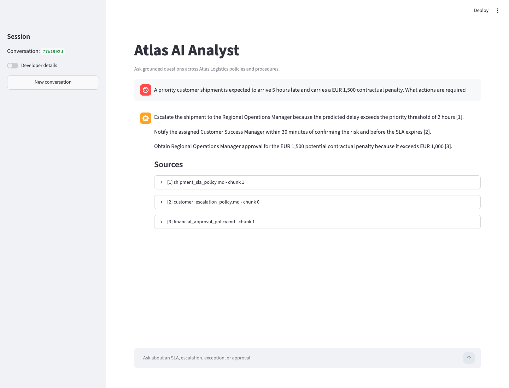
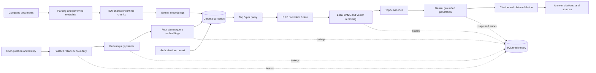

# Atlas AI Analyst

> An evaluated enterprise RAG system designed for grounded answers, cross-policy retrieval, authorization isolation, and reliable serving.

Atlas AI Analyst answers operational questions across internal policies and procedures, returns inspectable evidence, and refuses unsupported guidance.
The project treats retrieval quality, citation faithfulness, provider reliability, and access control as measurable engineering concerns rather than prompt-only features.

| Evaluation cases | Best Recall@5 | Best MRR | Best Full@5 | Automated tests |
|---:|---:|---:|---:|---:|
| 50 | 1.000 | 0.964 | 1.000 | 36 |

The retrieval metrics above come from the best isolated chunking experiment using 500-character chunks.
The dataset is synthetic, the corpus is fictional, and the hosted API measurements are non-production benchmarks.



_Representative Streamlit response rendered through the stable API contract using policy-derived evidence._

## The problem

Naive enterprise RAG looked plausible but failed important operational cases.

- Relevant evidence can rank outside Top-K even when semantic similarity appears strong.
- Multi-document questions require complete evidence, not merely one relevant passage.
- Nearest-neighbor retrieval always returns something, including for unsupported questions.
- A citation marker does not prove that the cited excerpt entails the associated claim.
- Hosted model providers can throttle, time out, become unavailable, or retire endpoints.
- Enterprise documents require authorization filtering before evidence enters the candidate pool.

The representative regression combined a priority shipment delay with a EUR 1,500 contractual penalty.
Answering it correctly required evidence from the Shipment SLA Policy, Customer Escalation Policy, and Financial Approval Policy.
The financial evidence originally appeared at rank 9, outside the final answer context.

## Final architecture



The production retrieval profile is frozen as `hybrid_v1`:

- Four atomic queries.
- Five vector candidates per query.
- A 12-chunk deduplicated candidate pool.
- RRF fusion followed by local BM25 and vector reranking.
- Five final evidence chunks.
- No production confidence threshold.

The measured chunking target is 500 characters, but the runtime remains at 800 characters until embeddings and the persisted index can be rebuilt together.

## Engineering story

### A. Retrieval

Naive vector retrieval exposed a concrete ranking failure when required financial evidence landed outside Top-K.
The retrieval pipeline was decomposed into query planning, per-query vector retrieval, stable-ID deduplication, RRF fusion, and reranking.
Recall@1, Recall@3, Recall@5, MRR, Full@5, and latency made each retrieval change testable.

### B. Grounding

Unsupported questions were expanded to include unrelated, domain-adjacent, plausible, and terminology-overlap cases.
Answer correctness, refusal precision, refusal recall, citation correctness, and claim-level citation entailment were measured separately.
The serving path validates every citation against the selected evidence and performs at most one bounded repair before returning the exact safe refusal.

### C. Reliability

The pipeline is served behind FastAPI with separate concurrency ceilings for planning, embeddings, and generation.
Admission control bounds pending requests and returns explicit overload responses with `Retry-After`.
One request deadline propagates through every stage and retry.
Circuit breakers, bounded retries, model fallback for transient failures, SQLite telemetry, and a separate validated streaming endpoint make provider behavior observable.
Authorization filters constrain vector search before candidates can enter fusion or reranking.

### D. Model selection

Gemini and NVIDIA components were evaluated independently while holding the corpus, questions, candidate generation, evidence, prompts, citation rules, and refusal behavior constant where applicable.
Each replacement had to clear quality, performance, reliability, and operational-complexity gates.
Faster inference alone was not considered a win.

## Results

### Evaluation scope

| Property | Scope |
|---|---|
| Knowledge base | Five fictional Atlas Logistics documents |
| Evaluation dataset | 50 synthetic, manually grounded questions |
| Supported questions | 42 |
| Unsupported questions | 8 |
| Categories | Direct, paraphrased, cross-document, ambiguous, unsupported, authorization, conversational |
| Providers | Hosted Gemini and NVIDIA development APIs |
| Benchmark status | Engineering experiment, not a production capacity benchmark |

### Retrieval by category

This table reports the 50-case expanded evaluation at the frozen runtime chunk size of 800 characters using NVIDIA embeddings and the current local hybrid reranker.
Unsupported cases have no relevant evidence and are excluded from retrieval recall.

| Category | Supported cases | Recall@1 | Recall@3 | Recall@5 | MRR | Full@5 |
|---|---:|---:|---:|---:|---:|---:|
| Direct | 8 | 1.000 | 1.000 | 1.000 | 1.000 | 1.000 |
| Paraphrased | 7 | 0.857 | 1.000 | 1.000 | 0.929 | 1.000 |
| Cross-document | 7 | 0.381 | 0.857 | 0.952 | 0.905 | 0.857 |
| Ambiguous | 7 | 0.857 | 1.000 | 1.000 | 0.929 | 1.000 |
| Authorization | 6 | 1.000 | 1.000 | 1.000 | 1.000 | 1.000 |
| Conversational | 7 | 0.929 | 1.000 | 1.000 | 1.000 | 1.000 |
| **Overall** | **42** | **0.837** | **0.976** | **0.992** | **0.960** | **0.976** |

Cross-document evidence completeness remains the most difficult retrieval category.

### Chunking experiment

NVIDIA embeddings, the corpus, fixed retrieval queries, overlap, and retrieval strategy were held constant across isolated indexes.

| Chunk size | Chunks | Recall@1 | Recall@3 | Recall@5 | MRR | Full@5 | Retrieval p95 |
|---:|---:|---:|---:|---:|---:|---:|---:|
| 300 | 66 | 0.837 | 0.956 | 0.980 | 0.960 | 0.952 | 4.05 ms |
| **500** | **31** | **0.853** | **0.984** | **1.000** | **0.964** | **1.000** | **3.69 ms** |
| 800 | 16 | 0.837 | 0.976 | 0.992 | 0.960 | 0.976 | 3.73 ms |
| 1200 | 12 | 0.833 | 0.976 | 1.000 | 0.952 | 1.000 | 3.96 ms |

The 500-character configuration produced the strongest measured quality trade-off.
It is a future synchronized-index target, not a silent runtime change.

### Answer and refusal evaluation

The accepted current-provider baseline achieved 1.000 supported-answer correctness, refusal precision, refusal recall, and citation entailment on the earlier provider-backed answer suite.
The final hosted-provider comparison was affected by Gemini quota limits and therefore does not replace that accepted baseline.
NVIDIA generation completed 13 of 14 stratified cases, refused both unsupported cases correctly, and retained 1.000 citation entailment among surviving factual answers.
It achieved only 0.091 supported-answer correctness because strict citation validation forced most supported drafts into safe refusal.

## Failure to decision

| Observed failure | Evidence | Engineering decision |
|---|---|---|
| Financial approval evidence ranked 9 | Required policy was outside the answer context | Add atomic query planning, multi-query retrieval, stable-ID fusion, and reranking |
| Multi-query retrieval could still lose complete evidence | More searches changed candidate ordering without guaranteeing Full@5 | Freeze a measured hybrid RRF, BM25, and vector reranker |
| Synthetic concurrency-10 run produced 83.3% failures | Provider saturation became request failure | Add semaphores, admission control, queue timeouts, and explicit overload responses |
| Uncited bridge claims survived normal prompting | Retrieved evidence and cited evidence did not guarantee claim support | Add claim-level citation validation and one bounded repair |
| Nearest-neighbor search returned passages for unsupported questions | Similarity alone could not establish answerability | Measure refusal behavior and preserve exact deterministic abstention |
| NVIDIA generation achieved 9.1% supported-answer correctness | Strict validation converted most supported drafts into safe refusal | Reject the tested generation replacement |
| NVIDIA neural reranking improved MRR but reduced Full@5 | Earlier rank did not mean complete final evidence | Retain the local hybrid reranker |
| 500-character chunks won the isolated experiment | Recall@5 and Full@5 reached 1.000 with the best qualifying MRR | Record a future synchronized reindex target without changing the current index |
| Hosted endpoints returned 410, 429, and 503 responses | Models can retire, throttle, or become temporarily unavailable | Keep providers replaceable and preserve retries, fallback, circuits, and telemetry |

## NVIDIA component experiment

The NVIDIA benchmark replaced one component at a time.
Separate Chroma collections prevented vectors from different embedding models from being mixed.
The neural reranker received the exact same 12-item candidate pool as the local hybrid reranker.
Generation received identical evidence, prompts, citation requirements, refusal wording, and repair policy.
Planning was scored by downstream retrieval rather than rewrite fluency.

> The experiment does not establish that NVIDIA infrastructure is inferior to Gemini.
> It establishes that the specific NVIDIA hosted models/configurations tested did not clear Atlas's predefined quality and operational gates on this workload.

| Component | Gemini/current | NVIDIA | Winner | Evaluation scope and decision |
|---|---|---|---|---|
| Embeddings | Recall@5 1.000, MRR 0.944 | Recall@5 0.963, MRR 0.833 | Gemini/current | Matched 19-case comparison; NVIDIA latency did not offset quality regression |
| Reranking | Recall@5 0.992, Full@5 0.976 | Recall@5 0.984, Full@5 0.952, p95 230 ms | Local hybrid | Same candidate pools across 50 cases; NVIDIA improved early ranks but lost evidence completeness |
| Generation | Accepted quality baseline retained | Correctness 0.091, repair rate 0.786, p95 52.1 s | Gemini/current retained | 14-case stratified sample; Gemini live comparison was quota-limited |
| Planning | Direct live comparison blocked by quota | Recall@5 0.948, MRR 0.772, p95 17.76 s | Gemini/current retained | NVIDIA completed 50 cases but missed the downstream retrieval reference gate |

The final architecture is intentionally not an all-provider migration.
On this small policy corpus, local fusion and reranking are cheaper, simpler, and more complete than the tested hosted neural reranker.

## Enterprise controls

| Business risk | Engineering control | Test or evidence |
|---|---|---|
| Unsupported operational guidance | Exact safe refusal and abstention evaluation | Unsupported question set plus refusal precision and recall |
| Hallucinated policy facts | Evidence-only generation and deterministic fact checks | Answer expectations and unsupported-claim evaluation |
| Misleading citations | Claim-level citation entailment and bounded repair | Citation validation tests and bridge-claim regression |
| Incomplete cross-policy answers | Multi-query retrieval, RRF fusion, Full@5 measurement | Financial and priority-notification regression cases |
| Cross-tenant leakage | Tenant and access-scope filtering inside vector retrieval | Authorization filtering test proves blocked chunks never enter the candidate pool |
| Provider saturation | Separate semaphores, admission limit, queue timeout, and `Retry-After` | Concurrency and admission-rejection tests |
| Provider failure | Bounded retry, transient-only fallback, and circuit breaker | Fallback and circuit state-transition tests |
| Request timeout | One end-to-end deadline propagated across stages and retries | Deadline and bounded-retry tests |
| Weak auditability | Stable chunk IDs, source metadata, structured traces, and SQLite telemetry | Trace artifacts, telemetry persistence test, and API response contract |

## Reproducibility

Python 3.12 or newer is recommended.

### Install

```bash
cd enterprise-rag-analyst
python3 -m venv .venv
source .venv/bin/activate
python -m pip install -r requirements.txt
```

### Configure credentials

```bash
cp .env.example .env
```

Add provider credentials only to `.env`.
Never place real credentials in `.env.example`, command output, traces, screenshots, or commits.

The minimum configuration for the default runtime is:

```dotenv
GOOGLE_API_KEY=replace-locally
PRIMARY_CHAT_MODEL=gemini-3.5-flash
FALLBACK_CHAT_MODEL=gemini-3.1-flash-lite
RAG_API_URL=http://127.0.0.1:8000
```

`NVIDIA_API_KEY` is optional unless running the NVIDIA experiment harness.

### Build the runtime index

```bash
python ingest.py
```

The current runtime index uses the frozen 800-character chunk configuration.

### Start the API

```bash
uvicorn api:app --host 127.0.0.1 --port 8000
```

Available endpoints include:

- `GET /health`
- `GET /metrics`
- `POST /query`
- `POST /query/stream`

### Start Streamlit

Run this in a second activated terminal:

```bash
streamlit run app.py
```

### Run quality and reliability tests

```bash
python -m unittest discover -s tests -v
```

### Inspect the retained evaluation artifacts

```bash
python -m json.tool eval/nt11_results.json > /dev/null
python -m json.tool eval/checkpoint11_traces.json > /dev/null
python -m json.tool eval/checkpoint11_questions.json > /dev/null
```

### Reproduce the NVIDIA component harness

The command below performs real hosted-provider calls and may consume quota.

```bash
python evaluation_checkpoint11.py --live
python finalize_checkpoint11.py
```

The harness keeps experimental indexes outside the production vector directory and never mixes embedding models in one collection.

## Repository map

```text
app.py                       Streamlit chat client
api.py                       FastAPI transport boundary
service.py                   Reliable request orchestration
retrieval.py                 Frozen hybrid_v1 retrieval pipeline
rag.py                       Grounded generation contract
citation_validation.py       Claim and citation validation
reliability.py               Admission, deadlines, retries, and circuits
telemetry.py                 Durable SQLite telemetry schema
ingest.py                    Governed document chunking and indexing
checkpoint11_dataset.py      Manually curated 50-case ground truth
evaluation_checkpoint11.py   Component and chunking benchmark harness
eval/                        Reproducible reports, results, and traces
tests/                       Quality, reliability, serving, and isolation gates
```

## Limitations

> [!IMPORTANT]
> This is a portfolio engineering case study, not a production benchmark or a general provider ranking.

- The corpus contains only five fictional company documents.
- The final evaluation contains 50 synthetic questions.
- Gemini free-tier quotas affected parts of the embedding, generation, and planner comparisons.
- Hosted NVIDIA endpoint results do not predict dedicated NVIDIA NIM performance, cost, or throughput.
- Citation entailment uses a conservative lexical check that can reject valid paraphrases.
- Generation was compared on a 14-case stratified subset rather than all 50 questions.
- The runtime remains at 800-character chunks pending a synchronized 500-character reindex.
- The hosted tests were development experiments and not production capacity benchmarks.

## What I learned

- Retrieval must be evaluated independently from generation.
- More queries can reduce retrieval quality when fusion and truncation are not controlled.
- Evidence completeness matters more than finding one relevant passage.
- Citations require claim-level validation.
- Abstention is part of correctness, not an optional fallback message.
- Backpressure is part of AI serving architecture.
- Authorization must constrain retrieval before candidate fusion.
- Model selection should be empirical and component-specific.
- GPU-backed inference is not automatically beneficial for every workload.
- Negative benchmark results are useful architecture evidence when controls remain fixed.

## Evidence

- [Final engineering report](eval/CHECKPOINT_11_REPORT.md)
- [Machine-readable results](eval/nt11_results.json)
- [Per-stage experiment traces](eval/checkpoint11_traces.json)
- [Final 50-case dataset](eval/checkpoint11_questions.json)
- [Visual comparison report](.lavish/checkpoint-11-report.html)

Atlas is frozen at the end of the evidence-closure benchmark.
There is no Checkpoint 12.
